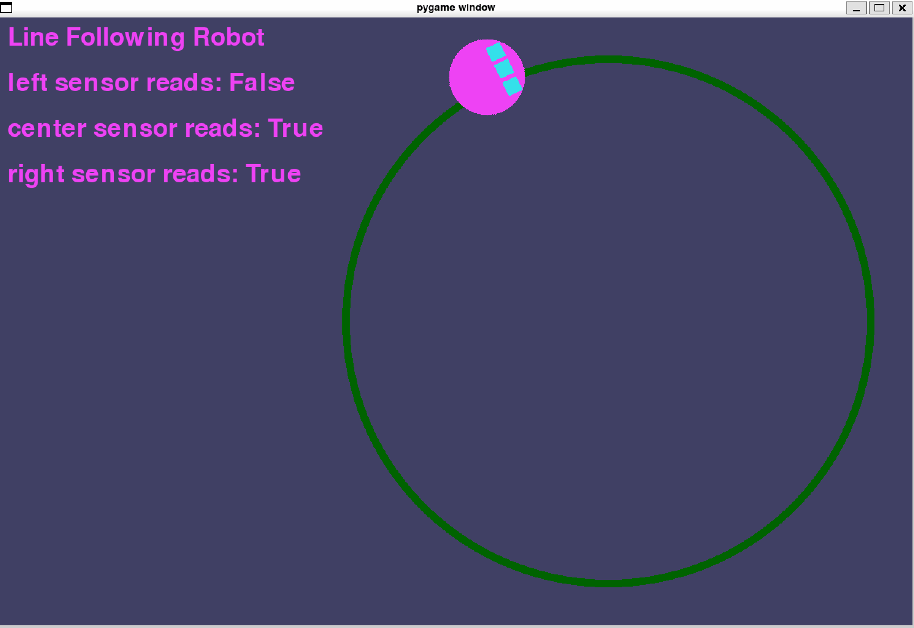

# line-following-robot

## Dependencies
- pygame : `pip3 install pygame`
- pyzmq: `pip3 install pyzmq`

## How to run
Manual:
- `python3 main.py --manual` : run the simulator using a manual controller, which responds to arrow key presses to move robot

Autonomous:
- `python3 main.py`: without the manual flag, the simulator will subscribe to a port `tcp://localhost:5556` for command messages and publish sensor readings to `tcp://*:5557`

If you run `python3 main.py` without the `--manual` flag, the simulator is reliant on a publisher to publish command messages to the robot. In another window (while the process running `python3 main.py` is still running), you can run `python3 autonomous_command_publisher.py`. This will subscribe to the sensor messages and publish command messages to the robot. You can also use it as an example to write and run your own autonomous command publisher.

## How to add your own custom autonomy code
- You can use the autonomous_command_publisher.py file as an example and create your own

## Todos
1. Some places I'm using class constants (sorta kinda not really since this is py) as colors and sizes. Might be better to change these all to default options as class constructor args, so that code is more extensible. 
2. It would be cool to make harder line objects that can be used in the sim. We could then expose them as cli args.
3. maxSpeed and maxAngularSpeed for robot are not exposed to user in any way, we might want to add cli args to make this adjustable.
4. Add functionality to Robot to be able to provide more functionality through its commands, such as variable speed settings.